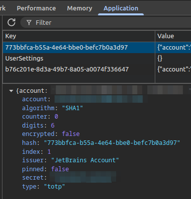

# Overview

This is a tool allowing to generate the same OTP code provided by https://github.com/Authenticator-Extension/Authenticator browser extension.

# Prerequisites

- NodeJS (It runs fine in version 22.13.1 normally should runs in any version >= 22.xx.xx)
- Time must be correct, especially the same time that used by https://github.com/Authenticator-Extension/Authenticator in your PC
- Create a file `.env` at the same level of the file `package.json` and put these data into the file :

```
ALGORITHM=<string>
CLOCK_OFFSET=<integer>
COUNTER=<integer>
DIGITS=<integer>
PERIOD=<integer>
SECRET=<string>
TYPE=<string>
```

Replace the `<string>` with the appropriated string value. Replace the `<integer>` with the appropriated integer value.

For `ALGORITHM`, it can support one of the value :

- `SHA1`
- `SHA256`
- `SHA512`
- `GOST3411_2012_256`
- `GOST3411_2012_512`

For `TYPE`, it can support one of the value :

- `totp`
- `hotp`
- `hex`
- `hhe`
- `battle`
- `steam`

To find these information in Google Chrome (normally in the similar way for other browser), open `chrome://extensions`. Search `Authenticator` extension.


Then, click on `service worker`


DevTools window will be opened. Click on `Application` -> `Storage` -> `Extension storage` -> `Sync`.


Then, select one of the row in `Key` column. Below, you will found configuration details. Ensure, you are in the correct configuration by checking `issuer` value.



- `algorithm` corresponds to `ALGORITHM`
- `counter` corresponds to `COUNTER`
- `digits` corresponds to `DIGITS`,
- `secret` correponds to `SECRET`,
- `type` corresponds to `TYPE`;

Missing information like :

- `PERIOD` takes value `30`
- `CLOCK_OFFSET` takes value `0`. If you have activated Chrome sync time, please go to https://github.com/Authenticator-Extension/Authenticator and do reverse engineering to calculate to value of `CLOCK_OFFSET`.

# Installation

```
npm install
```

# Running

```
npm start
```

or

```
node src/index.js
```

It will outputs 6 digits like

```
824913
```

Compare the result with the result provides by Authenticator extension. If there is difference value, verify that all parameters in `.env` is correct. Check if `PERIOD`, `CLOCK_OFFSET` are correct.
